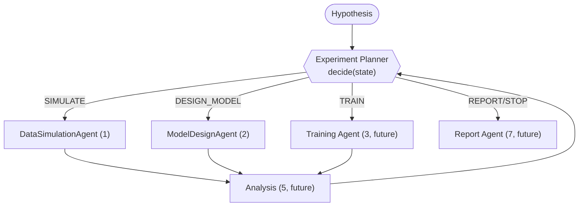

# Experiment Planner — Design Proposal (WIP / for discussion)

**Last updated: 2026-06-06** · **Status: proposal + skeleton only — no planning logic implemented**

The Experiment Planner is agent **#6** of the pipeline. Its role, inputs/outputs,
decision space, and termination conditions are defined canonically in
[WORKFLOW_DESIGN.md](./WORKFLOW_DESIGN.md#6-experiment-planner) — this document does
**not** restate or compete with that; it proposes *how* the planner should reason
and orchestrate, and records the open question for collaborative decision.

Code: `src/dlens/agents/_experiment_planner.py` (skeleton), with the typed
interface in `src/dlens/schemas/_experiment.py` (`ExperimentState`,
`ExperimentRun`, `PlannerDecision`, `PlannerAction`). `ExperimentPlanner.decide()`
is a **no-op stub** and `.run()` raises `NotImplementedError` on purpose.

## Role recap (see WORKFLOW_DESIGN for the canonical version)

Given the original hypothesis and the full experiment history (every past
`ExperimentRun`: sim config/output, architecture, training logs, analysis), decide
the next action — loop back to Simulation / Model Design / Training, proceed to
Report, or stop — with a rationale and any parameter overrides. It is the "AI
scientist" core and, per WORKFLOW_DESIGN, "likely benefits from a larger model
(via API) using ReAct-style reasoning."

## The open design question: ReAct loop vs agentic tree search

### Option A — ReAct loop (single trajectory)

A linear Reason→Act→Observe loop: each iteration the planner reads the latest
analysis, reasons, and emits one `PlannerDecision`; the pipeline executes it,
appends an `ExperimentRun`, and loops.

- **Pros:** simple and debuggable; cheap (one trajectory); maps directly onto the
  WORKFLOW_DESIGN loop and the existing `ExperimentState.runs` history; aligns with
  the framework's stated ReAct support; easy to keep a human in the loop per step.
- **Cons:** greedy/local — a bad early decision can dominate; no systematic
  backtracking or comparison of alternative branches; sensitive to noisy single
  analyses.

### Option B — Agentic tree search (branch + evaluate)

Treat experiment configurations as nodes in a search tree; expand several
candidate decisions per step, evaluate (run or estimate), and select/prune (e.g.
beam search or MCTS-style selection over the experiment space).

- **Pros:** explores alternative architectures/sim regimes in parallel; less prone
  to local optima; produces a richer comparative record for the Report agent;
  natural fit for "try N variants, keep the best."
- **Cons:** compute cost multiplies (each node may be a full simulate→train→eval
  pass — hours on a cluster); requires a value/score function and dedup of similar
  nodes; much harder to keep a human in the loop; orchestration + state management
  complexity is significantly higher.

### Recommendation (for discussion)

Start with **ReAct (Option A)** as the v1 planner — it matches WORKFLOW_DESIGN and
the current sequential orchestration, is cheap, and is debuggable with a clear
per-step HITL checkpoint. Keep the `PlannerDecision` interface and `ExperimentState`
history **branch-friendly** (decisions are explicit and runs are immutable records)
so a tree-search planner can later wrap the same primitives — expanding multiple
`PlannerDecision`s per node and scoring resulting `ExperimentRun`s — without
reworking the data model. A budget guardrail (`max_iterations`, and later a
compute budget) bounds either strategy.

## How the planner orchestrates the subagents

The planner does not do the work; it **routes**. `agent_for(action)` returns the
wired subagent for a decision (today: `DataSimulationAgent` for `SIMULATE`,
`ModelDesignAgent` for `DESIGN_MODEL`; Training/Report are `None` until built). The
loop appends one `ExperimentRun` per executed step to `ExperimentState.runs`, which
becomes the planner's context on the next `decide()`.

## What is intentionally NOT built here

- No reasoning in `decide()` (no-op placeholder honoring only the iteration budget).
- No `run()` loop (raises `NotImplementedError`).
- No scoring/value function, no tree expansion, no Training/Inference/Analysis/Report agents.

These are deferred to the collaborative planner work; the skeleton exists so that
work plugs into a fixed, typed interface.
